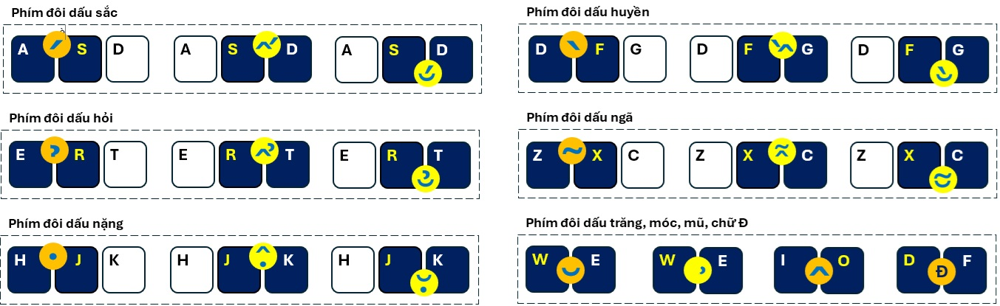
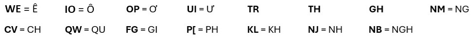

# Gõ tiếng Việt bằng kiểu gõ KK (Dual Keystrokes)

Đây là phương pháp nhấn phím đôi, có nghĩa là nhấn đồng thời hai phím cạnh nhau để gõ dấu tiếng Việt, không nhấn tuần tự từng phím đơn để gõ dấu như các phương pháp trước đây.

Kiểu gõ này không chiếm dụng các dead key như S,F,R,X,J (TELEX) hay 1,2,3,4,5,6,7,8 (VNI) mà dùng các phím đôi chữ cái để gõ dấu tiếng Việt. Nhờ vậy có thể gõ văn bản hỗn hợp tiếng Việt và tiếng Anh hay gõ mật khẩu, các ký hiệu như (EF, A1...) một cách mượt mà, tiện lợi mà không cần phải chuyển đổi qua lại giữa chế độ gõ Anh - Việt.

Để người dùng TELEX dễ tiếp cận, KK cũng định nghĩa 5 **phím dấu thanh** gồm: **S, F, R, X, J** tương ứng với 5 dấu thanh (sắc, huyền, hỏi, ngã, nặng) trong tiếng Việt. Từ đó định nghĩa 2 loại phím đôi:
- Phím đôi bên trái dấu thanh: gồm phím dấu thanh và phím sát bên trái nó
- Phím đôi bên phải dấu thanh: gồm phím dấu thanh và phím sát bên phải nó

# Hướng dẫn gõ dấu tiếng Việt trên bàn phím QWERTY:

Đầu tiên **gõ từ tiếng Việt không dấu**, ngoại trừ từ có **phụ âm Đ** thì nhấn phím đôi **D + F** để gõ chữ Đ trước. Sau đó gõ dấu thanh và dấu phụ cho cả từ như hình dưới:

<ins>**Trường hợp từ có dấu thanh**</ins>: sắc (*acute*), huyền (*grave*), hỏi (*hook*), ngã (*tilde*), nặng (*dot*)
- Nếu từ **không có dấu phụ thì nhấn phím đôi bên trái** một lần, KK sẽ tự điền dấu thanh đúng vị trí cho cả từ.
- Nếu từ **có dấu mũ thì nhấn phím đôi bên phải** một lần, KK sẽ tự điền dấu thanh và dấu mũ đúng vị trí cho cả từ.
- Nếu từ **có dấu trăng hay dấu móc thì nhấn phím đôi bên phải 2 lần** (nếu dấu mũ làm cho từ vô nghĩa thì nhấn 1 lần cũng được), KK sẽ tự điền dấu thanh và chọn các dấu phụ thích hợp cho cả từ.

<ins>**Trường hợp từ không có dấu thanh mà chỉ có dấu phụ**</ins>: mũ (*circumflex*), trăng (*breve*), móc (*horn*)
- Nếu từ **có dấu mũ thì nhấn phím đôi I + O**, KK sẽ tự điền dấu mũ đúng vị trí.
- Nếu từ **có dấu trăng hay dấu móc thì nhấn phím đôi W + E**, KK sẽ tự động điền các dấu phụ thích hợp cho cả từ.



# Tóm tắt kiểu gõ KK cơ bản:
- Từ **chỉ có dấu sắc** thì nhấn **S + A**; từ có **dấu sắc và dấu phụ** thì nhấn **S + D**.
- Từ **chỉ có dấu huyền** thì nhấn **D + F**; từ có **dấu huyền và dấu phụ** thì nhấn **F + G**.
- Từ **chỉ có dấu hỏi** thì nhấn **E + R**; từ có **dấu hỏi và dấu phụ** thì nhấn **R + T**.
- Từ **chỉ có dấu ngã** thì nhấn **Z + X**; từ có **dấu ngã và dấu phụ** thì nhấn **X + C**.
- Từ **chỉ có dấu nặng** thì nhấn **H + J**; từ có **dấu nặng và dấu phụ** thì nhấn **J + K**.
- Từ **không dấu thanh: chỉ có dấu mũ** thì nhấn **I + O**, chỉ có **dấu trăng hay dấu móc** thì nhấn **W + E**.
- Gõ phụ âm "Đ" thì nhấn **D + F**.

Nếu thuần thục cách gõ KK cơ bản, có thể dùng các phím đôi KK mở rộng để gõ phụ âm kép hay nguyên âm kép nhanh hơn như hình dưới:



**Tóm tắt các phím đôi KK mở rộng**:

W + E = "Ê", I+O = "Ô", O + P = "Ơ", U + I = "Ư", T + R = "TR", T + H = "TH", G + H = "GH", N + M = "NG",

C + V = "CH", Q + W = "QU", F + G = "GI", P + [ = "PH", K + L = "KH", N + J = "NH", N + B = "NGH"

> [!NOTE]
> KK là kiểu gõ dành cho bàn phím máy tính (PC/ Laptop), không dùng cho bàn phím cảm ứng (smartphone, tablet...).

# Online Demo: [kk.ai.vn](https://kk.ai.vn)

# Online Typing Test: [kk.ai.vn/test](https://kk.ai.vn/test)

# Minh họa cách nhúng VietKK vào trang web:
Chương trình vietkk.js dùng để tích hợp phương pháp gõ KK vào các TextBox, TextArea trên trình duyệt web (đã test trên MS Edge).
```javascript
<script type="text/javascript" src="vietkk.js"></script>
<script>
    var textArea = document.getElementById("userInput");
    var vKK = new VietKK();
    vKK.attach(textArea);
    vKK.setMode(1);
</script>
```
Tham khảo file example.html

© 2024 **Lê Phước Lộc** *(phuocloc@gmail.com)*
