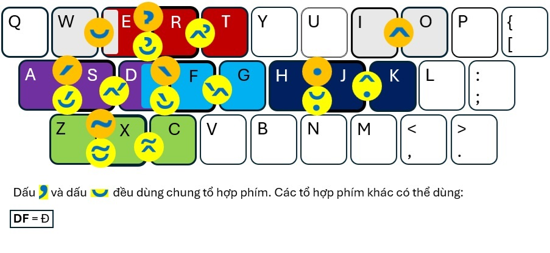

# Gõ tiếng Việt bằng KK (Key Combination)

Tổ hợp phím có nghĩa là nhấn đồng thời 2 phím cùng lúc để gõ dấu tiếng Việt, không gõ tuần tự từng phím dấu nữa.

Phương pháp này không chiếm dụng các dead key như S,F,R,X,J (TELEX) hay 1,...,8 (VNI) để gõ dấu mà chỉ dùng các cặp phím chữ (***ít có phần mềm nào dùng ngoại trừ games***). Nhờ vậy có thể gõ xen kẽ tiếng Việt và tiếng Anh một cách tiện lợi.

Đầu tiên **gõ chữ không có dấu**, sau đó **thêm đồng thời dấu thanh và dấu phụ** bằng cách nhấn cùng lúc cặp phím như hình dưới.
- **Phím dấu thanh chính** gồm: **S, F, R, X, J** (sắc, huyền, hỏi, ngã, nặng). Nhấn phím trái hay phải cùng lúc với phím chính để gõ dấu.
- Để có **dấu mũ thì nhấn cặp phím bên phải**, **các dấu phụ còn lại thì nhấn cặp phím bên trái** (nhấn luân phiên để đổi dấu).

Ví dụ: **dấu sắc có mũ** thì nhấn **S** + phím phải (**D**); **chỉ dấu sắc** thì nhấn **S** + phím trái (**A**); **dấu sắc có trăng** thì nhấn **2 lần S + A**.

Phụ âm **Đ**: nhấn cặp phím **DF**. Ngoài ra, nếu thuần thục có thể dùng các cặp phím khác để gõ tiện hơn như ghi chú bên dưới.

# Hướng dẫn gõ trên bàn phím QWERTY:


# Online Demo: [k2.ai.vn/kk](https://k2.ai.vn/kk)

# Minh họa cách nhúng VietKK vào trang web:
Chương trình vietkk.js dùng để tích hợp phương pháp gõ KK vào các TextBox, TextArea trên trình duyệt web (đã test trên MS Edge).
```javascript
<script type="text/javascript" src="vietkk.js"></script>
<script>
    var textArea = document.getElementById("userInput");
    var vKK = new VietKK();
    vKK.attach(textArea);
    vKK.setMode(1);
</script>
```
Tham khảo file example.html

© 2024 **Lê Phước Lộc** *(phuocloc@gmail.com)*
